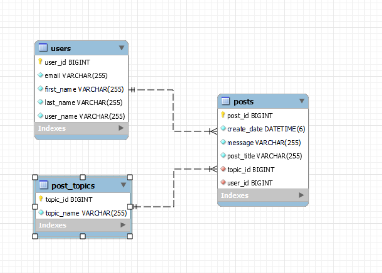

#Recommended Order: <br><br>
#1 Topics:<br>
PUT METHOD: localhost:8080/topics "Inserting item via json by the example"<br>
GET METHOD: localhost:8080/topics "Shows all topics"<br>
GET METHOD: localhost:8080/topics/id "Shows topics by id"<br>
UPDATE METHOD: localhost:8080/topics/id "Requires Topic object and Long id"<br>
DELETE METHOD: localhost:8080/topics/id "Deletes the topic by id"<br>

```json
{
        "topicName": "Coding"
    }
```

#2 Users:<br>
PUT METHOD: localhost:8080/users "Inserting item via json by the example"<br>
GET METHOD: localhost:8080/users "Shows all Users"<br>
GET METHOD: localhost:8080/users/id "Shows users by id"<br>
UPDATE METHOD: localhost:8080/users/id "Requires User object and Long id"<br>
DELETE METHOD: localhost:8080/users/id "Deletes the user by id"<br>
```json
{
        "userName": "user name",
        "firstName": "first name",
        "lastName": "last name",
        "email": "email@email.com"
    }
```

#3 Posts:<br>
PUT METHOD: localhost:8080/posts "Inserting item via json by the example"<br>
GET METHOD: localhost:8080/posts "Shows all posts"<br>
GET METHOD: localhost:8080/posts/id "Shows posts by id"<br>
UPDATE METHOD: localhost:8080/posts/id "Requires Post object and Long id"<br>
DELETE METHOD: localhost:8080/posts/id "Deletes the post by id"<br>
```json
    {
        "postTitle": "Post About Programming",
        "topic_id": {
            "topic_id": 1
        },
        "user_id": {
            "user_id": 1
        },
        "message": "It's always fun when you don't have bugs."
    }
```

ERR Diagram:<br>
